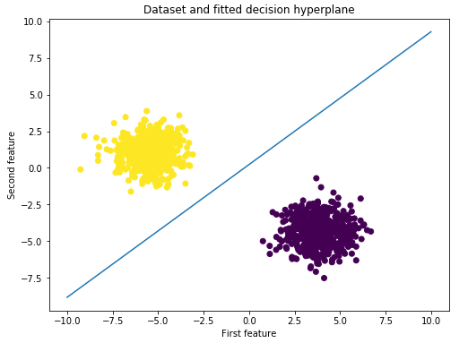

# Machine learning basics(中文）

【增加了中文翻译】

This repository contains implementations of basic machine learning algorithms in plain Python (Python Version 3.6+). All algorithms are implemented from scratch without using additional machine learning libraries. The intention of these notebooks is to provide a basic understanding of the algorithms and their underlying structure, *not* to provide the most efficient implementations. 

- [Linear Regression（逻辑回归）](linear_regression.ipynb)
- [Logistic Regression（线性回归）](logistic_regression.ipynb)
- [Perceptron（感知机）](perceptron.ipynb)
- [k-nearest-neighbor（K 最近邻）](k_nearest_neighbour.ipynb)
- [k-Means clustering（K 均值聚类）](kmeans.ipynb)
- [Simple neural network with one hidden layer（单隐层神经网络）](simple_neural_net.ipynb)
- [Multinomial Logistic Regression（多项式逻辑回归）](softmax_regression.ipynb)

  
  
  

## License

See the LICENSE file for license rights and limitations (MIT).
